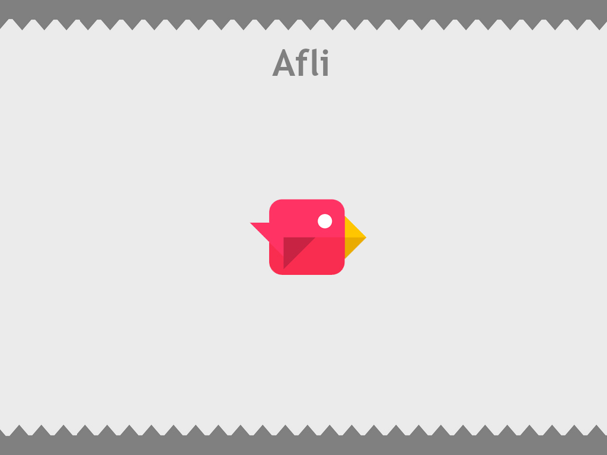

<!-- PROJECT SHIELDS -->
<!--
*** I'm using markdown "reference style" links for readability.
*** Reference links are enclosed in brackets [ ] instead of parentheses ( ).
*** See the bottom of this document for the declaration of the reference variables
*** for contributors-url, forks-url, etc. This is an optional, concise syntax you may use.
*** https://www.markdownguide.org/basic-syntax/#reference-style-links
-->
[![Issues][issues-shield]][issues-url]
[![MIT License][license-shield]][license-url]
[![LinkedIn][linkedin-shield]][linkedin-url]
[![Version][version-shield]][version-url]

<!-- PROJECT LOGO -->
 

  

  <h3 align="center">Afli</h3>

  

    A machine plays Don't Touch The Spikes!
     
     
     
    <a href="https://github.com/askudlarek/Afli/issues">Report Bug</a>
    ·
    <a href="https://github.com/askudlarek/Afli/issues">Request Feature</a>
  

<!-- TABLE OF CONTENTS -->
## Table of Contents

* [About the Project](#about-the-project)
  * [Built With](#built-with)
* [Disclaimer](#disclaimer)
* [Roadmap](#roadmap)
* [Contributing](#contributing)
* [License](#license)
* [Acknowledgements](#acknowledgements)

<!-- ABOUT THE PROJECT -->
## About The Project

Afli, pronounced A-Fly, is a program that allows a small genius bird to play a popular mobile game, Don't Touch The Spikes. This project will consist of a genetic evolution algorithm that demonstrates machine learning in the Python programming language. The bird will be able to jump and overtime should learn to navigate the dangerous spikes in the game in order to continue increasing its score.

This project is a senior project for my degree in Computer Science, but after completion of the degree I will open it up to allow anyone to contribute in any way they wish.

### Built With
This project will be created with the latest version of the Python coding language, 3.8.

<!-- DISCLAIMER -->
## Disclaimer

This project is a recreation of the game Don't Touch The Spikes. All of the images, code and other resources were created from scratch with the intent of creating a similar game to Don't Touch The Spikes to wich the machine can play. All credit for the games concept goes to Ketchapp, the games creators.

<!-- ROADMAP -->
## Roadmap

See the [open issues](https://github.com/askudlarek/Afli/issues) for a list of proposed features (and known issues). You can also visit my [trello board](https://trello.com/b/LGSDImUR/afli) to see what I have completed, am currently working on, and things that still need to be done, along with rough deadlines for each task.

<!-- CONTRIBUTING -->
## Contributing

Since the project is a senior project for class, the contributions will be limited at first, however, upon completion of the class I highly recommend contributing in whatever way you think will best fit the project.

If you are using [git flow](https://github.com/nvie/gitflow) which is **highly** recommended, then use the following steps to contribute.

1. Fork the Project
2. Create your Feature Branch (`git flow feature start AmazingFeature`)
3. Commit your Changes (`git commit -m 'Add some AmazingFeature'`)
4.  Finish your Feature Branch (`git flow feature finish AmazingFeature`)
5. Push to the Branch (`git push origin develop`)
6. Open a Pull Request

You can also use this helpful [git flow tutorial](https://www.atlassian.com/git/tutorials/comparing-workflows/gitflow-workflow) to learn about git flow and the best way to use it for the project.

<!-- LICENSE -->
## License

Distributed under the GNU General Public License v3.0. See `LICENSE` for more information.

<!-- ACKNOWLEDGEMENTS -->
## Acknowledgements
* [Git Flow](https://github.com/nvie/gitflow)
* [Img Shields](https://shields.io)
* [Choose an Open Source License](https://choosealicense.com)
* [Unittest](https://docs.python.org/3/library/unittest.html)
* [Pygame](https://www.pygame.org/news)
* [Pylint](https://www.pylint.org/)
* [TravisCI](https://travis-ci.org/)

<!-- MARKDOWN LINKS & IMAGES -->
<!-- https://www.markdownguide.org/basic-syntax/#reference-style-links -->
[version-url]:https://github.com/askudlarek/Afli/tree/master
[version-shield]:https://img.shields.io/github/v/tag/askudlarek/afli
[issues-shield]: https://img.shields.io/github/issues/askudlarek/afli
[issues-url]: https://github.com/askudlarek/Afli/issues
[license-shield]: https://img.shields.io/github/license/askudlarek/afli
[license-url]: https://github.com/askudlarek/Afli/blob/master/LICENSE
[linkedin-shield]: https://img.shields.io/badge/-LinkedIn-black.svg?style=flat-square&logo=linkedin&colorB=555
[linkedin-url]: https://www.linkedin.com/in/adam-skudlarek-596b21148/